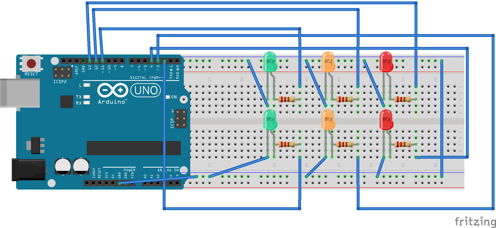

# Feux Tricolor

Simulation de feux tricolores pour carrefour à deux voies réalisée avec Arduino.

## Description

Ce projet implémente un contrôleur de feux tricolores à deux phases à l'aide de **6 LEDs** (2 rouges, 2 oranges, 2 vertes) connectées à une carte Arduino. Les feux alternent entre les deux voies avec un cycle de **12 secondes**.

### Cycle de fonctionnement

| Étape | Durée | Voie 1 (Rouge, Orange, Verte) | Voie 2 (Rouge, Orange, Verte) |
|-------|-------|-------------------------------|-------------------------------|
| 1 | 5 s | 🔴 Rouge | 🟢 Vert |
| 2 | 1 s | 🔴 Rouge | 🟡 Orange |
| 3 | 5 s | 🟢 Vert | 🔴 Rouge |
| 4 | 1 s | 🟡 Orange | 🔴 Rouge |

## Matériel requis

- 1 carte Arduino (Uno, Nano ou compatible)
- 6 LEDs (2 rouges, 2 oranges, 2 vertes)
- 6 résistances (adaptées aux LEDs)
- 1 breadboard
- Fils de connexion

## Brochage

| Variable dans le code | Couleur réelle de la LED | Broche Arduino |
|-----------------------|--------------------------|----------------|
| `blue_1` | 🔴 Rouge (voie 1) | 13 |
| `blue_2` | 🔴 Rouge (voie 2) | 4 |
| `jaune_1` | 🟡 Orange (voie 1) | 12 |
| `jaune_2` | 🟡 Orange (voie 2) | 3 |
| `vert_1` | 🟢 Verte (voie 1) | 11 |
| `vert_2` | 🟢 Verte (voie 2) | 2 |

> **Note :** Dans le code, la variable `blue` correspond à la couleur **rouge** sur le schéma de câblage (voir l'image `feux_tricolor-2.png`).

## Installation

1. Ouvrir `feux_tricolor-2.ino` avec l'IDE Arduino.
2. Brancher la carte Arduino et sélectionner le bon port.
3. Téléverser le sketch.

## Dépendances

Aucune — le sketch utilise uniquement les fonctions de base de l'API Arduino (`pinMode`, `digitalWrite`, `delay`).

## Fichiers

| Fichier | Description |
|---------|-------------|
| `feux_tricolor-2.ino` | Code source principal |
| `feux_tricolor-2.png` | Schéma de câblage |
| `feux_tricolor-2.mp4` | Vidéo de démonstration |

## Auteur

**YaogoGerard** — gerardwyaogo@gmail.com
